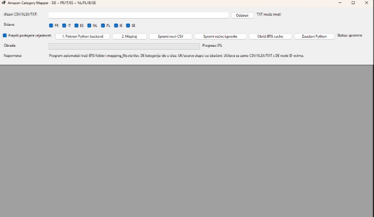
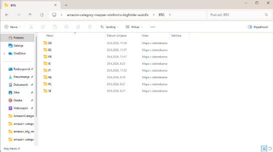
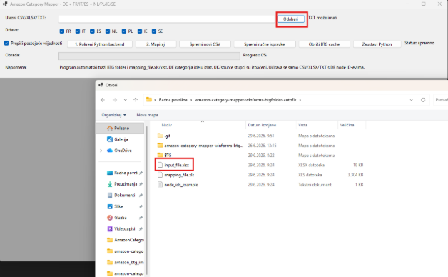
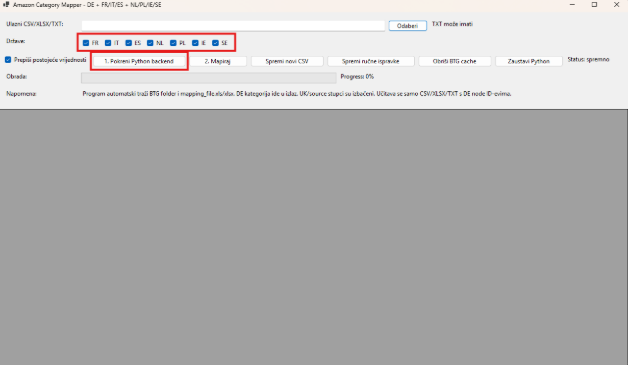
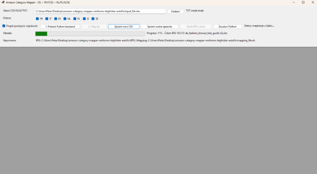
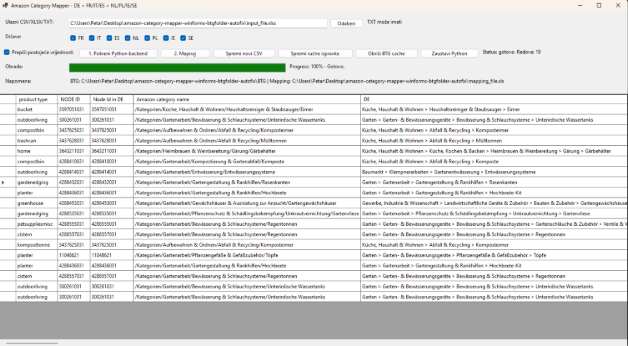
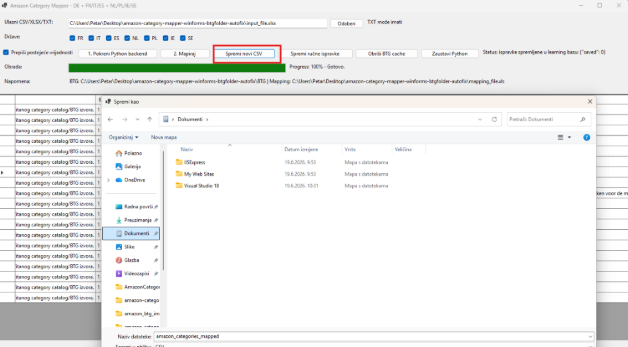
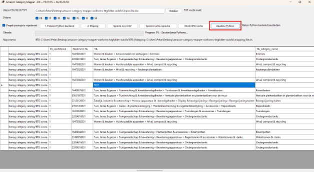

**Amazon Category Mapper**

Korisnička dokumentacija i upute za pokretanje

Verzija dokumentacije: 1.0  
Datum: 29.06.2026.

|
**Najvažnije pravilo**

Da bi mapiranje radilo, u ulaznoj datoteci mora biti vidljiv njemački Amazon Node ID. Program polazi od DE node ID-a i preko njega pokušava pronaći odgovarajuće kategorije za označene države.
|
|-|

***Slika 1. Glavni prozor aplikacije***

# **Sadržaj dokumentacije**

* svrha i kratki opis aplikacije
* što se koristilo u izradi aplikacije
* koje datoteke korisnik treba pripremiti
* koraci za pokretanje i mapiranje
* objašnjenje svih glavnih opcija u sučelju
* spremanje CSV-a i ručne ispravke
* korištenje BTG cachea i zaustavljanje Python backend-a
* najčešće greške i napomene za rad

# **1. Kratki opis aplikacije**

Amazon Category Mapper je desktop aplikacija namijenjena mapiranju Amazon kategorija iz njemačkog tržišta na odabrana europska tržišta. Korisnik kao ulaz predaje CSV, XLSX ili TXT datoteku u kojoj mora postojati njemački Node ID. Aplikacija zatim, ovisno o označenim državama, generira novi CSV s pripadajućim node ID-evima i nazivima kategorija.

Cilj aplikacije je da korisnik ne mora ručno birati BTG foldere, mapping datoteke ili pojedinačne Amazon kataloge. Program automatski traži potrebne podatke u folderu aplikacije i koristi ih za mapiranje.

|
**Važno**

Ako ulazna datoteka nema jasno vidljiv njemački Node ID, program nema pouzdanu početnu točku i mapiranje neće moći raditi ispravno.
|
|-|

# **2. Što se koristilo u izradi**

Aplikacija je podijeljena na dva glavna dijela: korisničko sučelje i backend logiku za obradu podataka.

* **WinForms desktop sučelje:** koristi se za izbor datoteke, odabir država, pokretanje mapiranja, prikaz progress bara i spremanje rezultata.
* **Python backend:** obrađuje ulazne datoteke, čita mapping podatke, čita BTG tree datoteke i vraća rezultat aplikaciji.
* **CSV/XLSX/TXT ulaz:** podržan je CSV i XLSX za tablične ulaze, te TXT kada korisnik ima samo popis njemačkih node ID-eva.
* **Amazon mapping datoteka:** koristi se za države za koje postoji direktni mapping.
* **BTG folder:** koristi se za traženje kategorija po BTG obiteljima i za države gdje nema direktnog node mappinga.
* **Lokalni prijevodni/keyword sloj:** pomaže kod usporedbe kategorija između jezika, primjerice DE prema PL, NL ili SE.
* **BTG cache:** koristi se za brže listanje i manje čekanje kod ponovljenog rada s istim BTG podacima.

# **3. Priprema prije pokretanja**

Prije rada treba provjeriti da se u folderu aplikacije nalaze potrebni podaci. Korisnik ne mora ručno unositi putanje za mapping i BTG, ali program ih mora moći pronaći. Kad se pulla projekt sve BTG datoteke su tu nalaze i mapping\_file!

* u folderu aplikacije treba postojati BTG folder s Amazon BTG tree datotekama, koje se nalaze na githubu
* u folderu aplikacije treba postojati mapping\_file.xls ili mapping\_file.xlsx, ako se koristi direktni mapping, koje se također nalaze na githubu i na službenoj stranici Amazona
* **Stvari koji se tiču korisnika**:
* ulazni CSV/XLSX/TXT mora sadržavati njemački Node ID
* za TXT ulaz svaki njemački Node ID može biti u zasebnom retku
* za CSV/XLSX ulaz stupac s njemačkim node ID-em mora biti vidljiv i prepoznatljiv
* ulazni CSV/XLSX/TXT mora sadržavati njemački Node ID
* za TXT ulaz svaki njemački Node ID može biti u zasebnom retku
* za CSV/XLSX ulaz stupac s njemačkim node ID-em mora biti vidljiv i prepoznatljiv

|
*Slika 2. Primjer foldera aplikacije s BTG folderom*
- 
|:-:|

# **4. Ulazne datoteke**

## **4.1 CSV ili XLSX**

CSV ili XLSX koristi se kada korisnik ima tablicu proizvoda, kategorija ili već postojećih node ID-eva. Najbitnije je da je u tablici dostupan njemački node ID. Naziv stupca može ovisiti o izvornoj datoteci, ali vrijednost DE node ID-a mora biti prisutna.

|
**Primjer XLSX stupca:**

**NODE ID** 1981004031 1981005031 1981006031
|
|-|

## **4.2 TXT s node ID-evima**

TXT datoteka može sadržavati samo popis njemačkih node ID-eva. Ovo je najjednostavniji ulaz kada korisnik ne želi pripremati cijeli CSV. Svaki ID se može zapisati u novi redak.

|**Primjer TXT ulaza:** 1981004031 1981005031 1981006031|
|-|

# **5. Pokretanje programa - korak po korak**

Ovo je najvažniji dio dokumentacije. Koraci se izvode ovim redoslijedom.

**1. Odaberi ulazni CSV/XLSX/TXT.** Klikne se gumb Odaberi i izabere se datoteka koju treba mapirati. Datoteka mora sadržavati njemački Node ID.

**2. Označi države koje želiš dobiti u izlazu.** U izlazni CSV ulaze samo označene države. Ako država nije označena, program je ne dodaje u novi CSV.

**3. Po potrebi označi ili makni opciju Prepiši postojeće vrijednosti.** Ako želiš da program zamijeni postojeće vrijednosti, ostavi opciju uključenu. Ako želiš čuvati postojeće vrijednosti kada postoje, opciju isključi.

**4. Klikni 1. Pokreni Python backend.** Nakon klika treba pričekati da se backend stvarno pokrene.

**5. Pričekaj status: backend radi.** Nemoj kliknuti Mapiraj dok status ne pokaže da je backend pokrenut i spreman.

**6. Klikni 2. Mapiraj.** Tek tada kreće stvarna obrada ulazne datoteke.

**7. Prati progress bar.** Progress bar prikazuje koliko je obrade završeno, a ispod se prikazuju rezultati ili poruke.

**8. Provjeri rezultate.** Ako neki rezultat nije siguran, može biti označen kao da treba provjeru. Takve retke je dobro ručno pregledati.

**9. Spremi novi CSV.** Klikom na Spremi novi CSV sprema se rezultat mapiranja.

**10. Po potrebi napravi ručne ispravke.** Ako je lakše, korisnik može izmijeniti rezultate u aplikaciji i zatim spremiti ručne ispravke ili ponovno spremiti CSV.

**11. Na kraju zaustavi Python.** Prije izlaza iz programa preporučeno je kliknuti Zaustavi Python kako backend ne bi ostao raditi u pozadini.

|
*Slika 3. Odabir ulazne CSV/XLSX/TXT datoteke*

|:-:|

|
*Slika 4. Odabir država i pokretanje Python backend-a*

|:-:|

|
*Slika 5. Progress bar tijekom mapiranja*

|:-:|

# **6. Odabir država**

Korisnik sam bira za koje države želi dobiti stupce u novom CSV-u. Ako je označena samo jedna država, u izlazu se dodaju samo stupci za tu državu. Ako je označeno više država, program pokušava popuniti svaku od njih.

* **FR, IT i ES:** mogu se mapirati direktnije ako postoje podaci u mapping datoteci.
* **NL, PL, IE i SE:** mogu se tražiti preko BTG tree podataka, BTG obitelji, sličnosti i prijevodnih pojmova.
* **DE:** njemačka kategorija i njemački node ID koriste se kao početna točka i mogu se uključiti u izlaz radi kontrole.

Neoznačene države ne ulaze u novi CSV. To je važno jer korisnik tako može ubrzati obradu i dobiti samo podatke koji mu stvarno trebaju.

# **7. Objašnjenje opcija u sučelju**

|**Element u aplikaciji**|**Opis**|
|-|-|
|Ulazni CSV/XLSX/TXT|Putanja do datoteke koju korisnik želi mapirati. Može biti CSV/XLSX ili TXT s DE node ID-evima.|
|Odaberi|Otvara prozor za izbor ulazne datoteke.|
|Države|Korisnik označava samo države koje želi dobiti u novom CSV-u. Neoznačene države se ne dodaju u izlaz.|
|Prepiši postojeće vrijednosti|Ako je označeno, program može zamijeniti postojeće vrijednosti u stupcima. Ako nije označeno, postojeće vrijednosti se čuvaju kad je moguće.|
|1. Pokreni Python backend|Pokreće Python dio aplikacije koji učitava mapping, BTG podatke i prima zahtjeve iz WinForms sučelja.|
|2. Mapiraj|Pokreće mapiranje nakon što status pokaže da backend radi.|
|Spremi novi CSV|Sprema rezultat mapiranja u novu CSV datoteku.|
|Spremi ručne ispravke|Sprema promjene koje je korisnik ručno izmijenio u tablici rezultata.|
|Obriši BTG cache|Briše spremljene BTG podatke ako se BTG tree ažurirao ili ako korisnik želi prisiliti ponovno učitavanje.|
|Zaustavi Python|Ručno zaustavlja Python backend. Preporučeno je kliknuti prije izlaska iz programa.|
|Status|Prikazuje trenutno stanje: spremno, pokretanje, backend radi, obrada, greška i slično.|
|Progress|Prikazuje postotak obrade i pomaže korisniku vidjeti koliko još mapiranje traje.|

# **8. Kako radi mapiranje**

Program kreće od njemačkog Node ID-a. Za direktno podržane države traži odgovarajući node kroz mapping podatke. Za države gdje nema direktnog mappinga koristi BTG tree datoteke. Umjesto da pretražuje sve datoteke i time nepotrebno usporava rad, program prvo određuje BTG obitelj njemačke kategorije.

Primjer: ako je njemačka kategorija pronađena u obitelji de\_automotive, program za švedsku verziju traži prvenstveno u se\_automotive. Na taj način se izbjegava situacija da se kategorija iz vrta mapira u kuhinju samo zato što tekstualna sličnost slučajno izgleda dovoljna.

Uz to se koristi lokalni keyword/prijevodni sloj. On pomaže programu da prepozna da se, primjerice, pojmovi iz njemačke kategorije trebaju tražiti u odgovarajućem jeziku target države. Ako program nema dovoljno siguran rezultat, bolje je da ostavi rezultat za provjeru nego da upiše potpuno pogrešnu kategoriju.

|
**Praktična napomena**

Kod kategorija koje su jako slične ili imaju loše nazive u BTG datotekama, rezultat treba ručno provjeriti. Program pomaže ubrzati rad, ali kod nesigurnih kategorija ručna kontrola je i dalje najbolja opcija.
|
|-|

# **9. Spremanje novog CSV-a i ručne ispravke**

Nakon završetka mapiranja korisnik može spremiti novi CSV. Taj CSV se kasnije može uređivati u Excelu ili drugom alatu za tablice. Ako je korisniku lakše ispraviti pojedine vrijednosti odmah u aplikaciji, može ručno urediti podatke i spremiti ručne ispravke.

* Spremi novi CSV - koristi se za izvoz rezultata mapiranja.
* Spremi ručne ispravke - koristi se kada korisnik ručno popravi podatke u aplikaciji, ovo prvenstveno služi za ML, nije bitno za korisnika, ako odlučimo nastavljati s ovim projektom, da u bazi čuvamo podatke koji su izmjenjeni pa da tako uči iz grešaka
* Nakon ručnih ispravki preporučeno je ponovno spremiti CSV kako bi se dobila završna verzija datoteke.

|
*Slika 6. Prikaz rezultata i ručno uređivanje podataka*

|:-:|

|
*Slika 7. Spremanje novog CSV-a*

|:-:|

# **10. BTG cache**

BTG cache postoji da bi aplikacija brže listala i učitavala BTG podatke. Bez cachea bi program svaki put morao ponovno čitati velike BTG tree datoteke, što može značajno produžiti čekanje.

Gumb Obriši BTG cache koristi se ako se BTG tree ažurirao na Amazonu ili ako su zamijenjene BTG datoteke u folderu aplikacije. Nakon brisanja cachea program će ponovno učitati BTG podatke iz datoteka. Prvo pokretanje nakon toga može trajati duže, ali kasnije obrade mogu biti brže.

* Cache ne mijenja ulazni CSV/TXT.
* Cache ne briše ručne ispravke.
* Cache služi samo za brže učitavanje BTG podataka.
* Ako su BTG datoteke promijenjene, preporučeno je obrisati cache prije novog mapiranja.

# **11. Zaustavljanje Python backend-a**

Python backend je odvojeni proces koji aplikacija koristi za obradu podataka. Zbog toga je dodana opcija Zaustavi Python. Preporučeno je kliknuti taj gumb prije izlaza iz programa, posebno ako je korisnik ranije pokrenuo backend.

Ako korisnik zatvara aplikaciju, program bi također trebao pokušati zaustaviti Python backend. Ipak, ručno zaustavljanje je jasnije i sigurnije jer korisnik odmah vidi da je backend ugašen.

|
*Slika 8. Zaustavljanje Python backend-a prije izlaza iz programa*

|:-:|

# **12. Najčešće greške i rješenja**

|**Problem**|**Što provjeriti**|
|-|-|
|Mapiranje ne kreće|Provjeriti je li kliknut Pokreni Python backend i piše li status: backend radi.|
|Program ne nalazi kategorije|Provjeriti postoji li njemački Node ID u ulaznoj datoteci.|
|Nema podataka za neku državu|Provjeriti je li država označena prije mapiranja.|
|Kriva ili čudna kategorija|Provjeriti BTG obitelj i ručno pregledati retke koji nisu sigurni.|
|Program dugo učitava|Prvo učitavanje BTG podataka može trajati duže. Cache kasnije ubrzava rad.|
|Nakon ažuriranja BTG-a rezultati izgledaju stari|Kliknuti Obriši BTG cache i ponovno pokrenuti mapiranje.|
|Python ostao raditi|Kliknuti Zaustavi Python ili zatvoriti aplikaciju pa provjeriti je li proces ugašen.|

# **13. Kratki primjer rada**

Primjer rada u najkraćem obliku:

**1. Korisnik pripremi TXT ili CSV.** U datoteci mora postojati DE Node ID.

**2. Korisnik klikne Odaberi.** Izabere ulaznu datoteku.

**3. Korisnik označi države.** Primjerice FR, IT, ES, NL, PL, IE i SE.

**4. Korisnik pokrene Python backend.** Čeka dok status ne kaže da backend radi.

**5. Korisnik klikne Mapiraj.** Prati progress bar dok obrada ne završi.

**6. Korisnik provjeri rezultat.** Po potrebi ručno ispravi nejasne kategorije.

**7. Korisnik spremi CSV.** Dobivena datoteka je spremna za daljnju obradu.

**8. Korisnik zaustavi Python.** Klikne Zaustavi Python prije izlaza.

|
**Završna napomena**

Najvažnije za ispravan rad je da ulaz ima njemački Node ID, da je Python backend pokrenut prije mapiranja i da su označene samo države koje korisnik želi dobiti u novom CSV-u.
|
|-|

